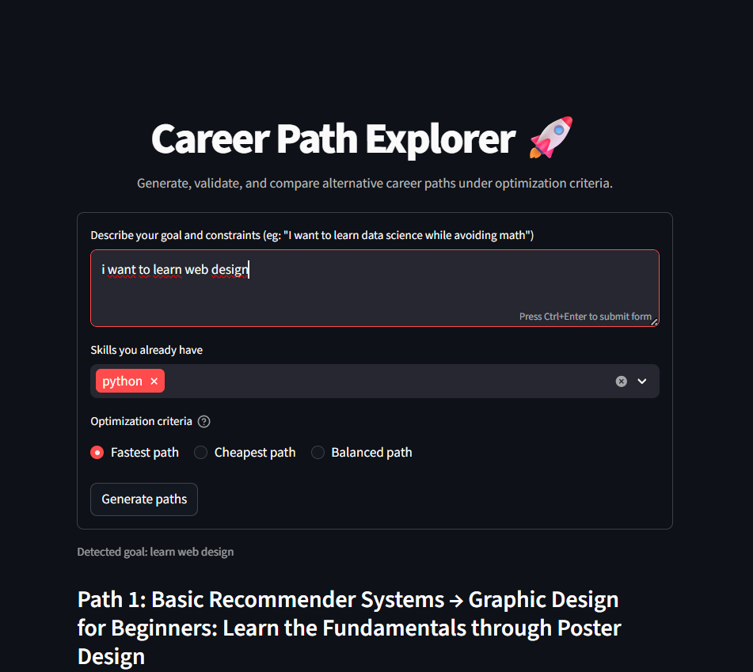
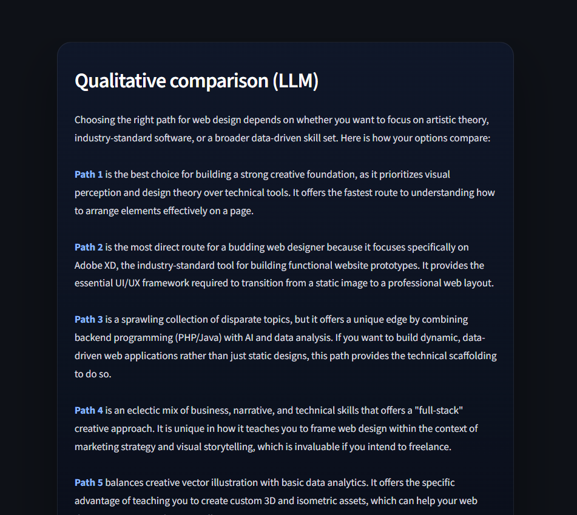
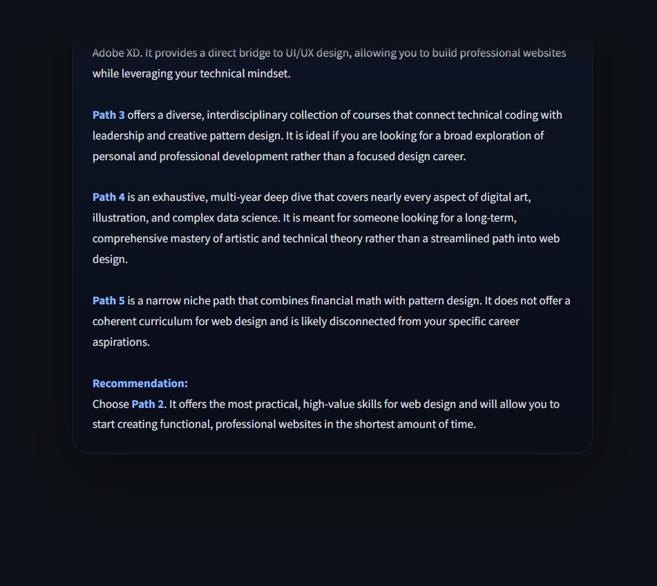

<h1 align="center">LLM Pathway Evaluator 🚀</h1>


**Custom Learning Path Generation for Online Course Catalogs**

This system solves a constrained planning and optimization problem in the professional learning domain. Given a set of candidate decisions—courses, skills, certifications—it generates multiple valid learning pathways and evaluates them across technical metrics such as cost, duration, difficulty, and semantic alignment. The architecture uses a Large Language Model (LLM) as an analysis engine to compare, rank, and explain alternative progression strategies.

## Overview 🔍

The project converts normalized online course catalogs into structured learning trajectories. Using normalized course metadata and NLP embeddings, the system:

- 📥 Extracts and normalizes online course information.
- 🧠 Computes semantic embeddings and similarity scores.
- 🛤️ Builds learning pathways that connect skills, objectives, and prerequisites.
- 🌐 Presents results through a lightweight Streamlit web UI.

The goal is to help learners, professionals, and teams identify the most appropriate sequence of courses based on goals and prior experience.

## Project Structure 🗂️

```
LLM Pathway Evaluator/
├── README.md                   # Project documentation
├── requirements.txt            # Python dependencies
├── .env                        # Environment variables for API keys and config
├── Alternative Career Paths Report.pdf  # Project PDF report
├── data/
│   ├── embedding.json          # Cached course embeddings
│   ├── normalized_courses.json # Normalized course metadata
│   └── csv/                    # Raw dataset CSV files
│       ├── dataset_1.csv
│       ├── dataset_2.csv
│       └── ...
├── previews/                   # UI preview images shown in README
├── experiments/                # Experimental test cases and quality tests
├── src/
│   ├── app.py                  # Streamlit UI for pathway exploration
│   ├── download_dataset.py     # Kaggle dataset download and normalization
│   ├── llm_adapter.py          # LLM / spaCy adapter for embeddings and explanations
│   └── planner.py              # Path planning and course modeling logic
├── tests/                      # Unit tests for core logic
└── .gitignore
```

## Installation 🛠️

### Prerequisites 📌

- Python 3.8+
- pip
- Internet access for dependency installation and spaCy model downloads

### 1. Clone the repository 📂

```bash
git clone https://github.com/jery04/LLM-Pathway-Evaluator.git
cd "LLM Pathway Evaluator"
```

### 2. Create and activate a virtual environment 🧰

```bash
python -m venv .venv
.\.venv\Scripts\Activate.ps1
```

If you use cmd:

```cmd
.\.venv\Scripts\activate.bat
```

If you use Git Bash or WSL:

```bash
source .venv/bin/activate
```

### 3. Install dependencies 📦

```bash
pip install -r requirements.txt
```

### 4. Prepare dataset files 📁

Verify the presence of the following data artifacts:

- `data/normalized_courses.json`
- `data/embedding.json`
- `data/csv/*.csv`

If the files are missing, regenerate them with:

```bash
python src/download_dataset.py
```

### 5. Create a `.env` file and obtain an API key 🔑

Before launching the web UI, create a `.env` file in the project root containing your Gemini API key:

```text
GEMINI_API_KEY=YOUR_API_KEY_HERE
```

How to create the `.env` file from the terminal:

- PowerShell (Windows):

```powershell
echo "GEMINI_API_KEY=YOUR_API_KEY_HERE" > .env
```

Step-by-step: how to obtain a Gemini API key (Google Generative AI):

1. 🌐 Open https://console.cloud.google.com/ and sign in with your Google account.
2. 📁 Create a new project or select an existing project using the project selector (top-left).
3. ⚙️ Go to "APIs & Services" → "Library" and search for "Generative AI" or "Generative AI API"; click "Enable" if it is not already enabled.
4. 🔑 Go to "APIs & Services" → "Credentials" → "Create credentials" → "API key".
5. 📋 Copy the newly created API key and paste it into the `.env` file as `GEMINI_API_KEY=YOUR_API_KEY_HERE`.
6. 🛡️ (Optional but recommended) In the Credentials section, restrict the API key by IP address, HTTP referrer, or API usage to improve security.

> Note: If you use Generative AI Studio (https://console.generativeai.google), the interface and flow may differ slightly; look for "Credentials" or "API keys" in that interface.


### 6. Run Tests 📋

To verify that all dependencies and setup steps are correct, run the project test harness with the following command:

```bash
python src/tests_runner.py
```

> Note: if any test fails, review the previous installation and setup steps before proceeding.

### 7. Launch the web UI (inside the created environment) 🚀

After creating the `.env` file with your API key, run the following command (inside the activated virtual environment):

```bash
streamlit run src/app.py
```

## Experiment 🧪

In the `experiments/` folder, a specific forced-condition test case was created to evaluate the response quality of the system. It contains a deliberately crafted set of courses designed to stress-test the recommendation engine across all three supported optimization criteria:

- **Fastest Path** – minimizes time to completion
- **Cheapest Path** – minimizes total cost
- **Balanced Path** – optimizes for both time and cost

The test dataset was intentionally constructed (not sampled from real data) to expose edge cases and verify that each routing strategy produces semantically correct and distinguishable recommendations.

### Running the Quality Test

To execute the experiment, run the following command from the project root:

```bash
python -m experiments.quality_test
```

This will run the full quality evaluation suite against all three path criteria and output the results for manual or automated inspection.


## Key Dependencies 📘

### Core Libraries
- `streamlit`: interactive web UI for career path generation and visualization
- `google-genai`: Google Gemini client for LLM-powered explanations
- `spacy`: NLP processing and skill extraction
- `langdetect`: automatic language detection
- `kagglehub` / `kagglesdk`: Kaggle dataset integration
- `numpy` / `scipy`: numerical computation and similarity calculations
- `python-dotenv`: environment variable management

### NLP Models
- `en-core-web-md`: English spaCy model
- `es-core-news-md`: Spanish spaCy model

## Example Output 🎯

A typical generated pathway might look like this:

<p align="center">
  
  
  <br/><br/>
  
  
</p>

---

<p align="center">Built with ❤️ by a human</p>